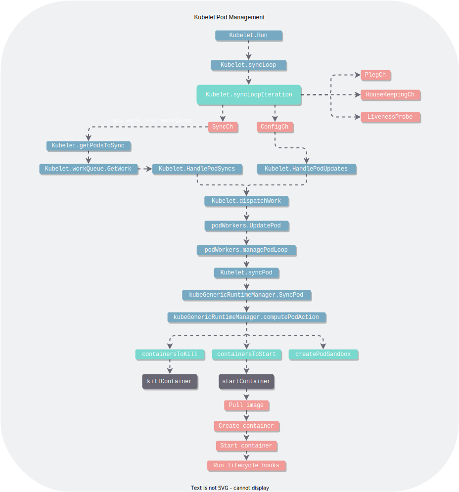

# K8s-Source-Code-Structure
Hi, I am going to share some structure graphs I have drawn when I am reading the source code of K8s.

They are aimed to help better understand the source code of K8s.

## Example

